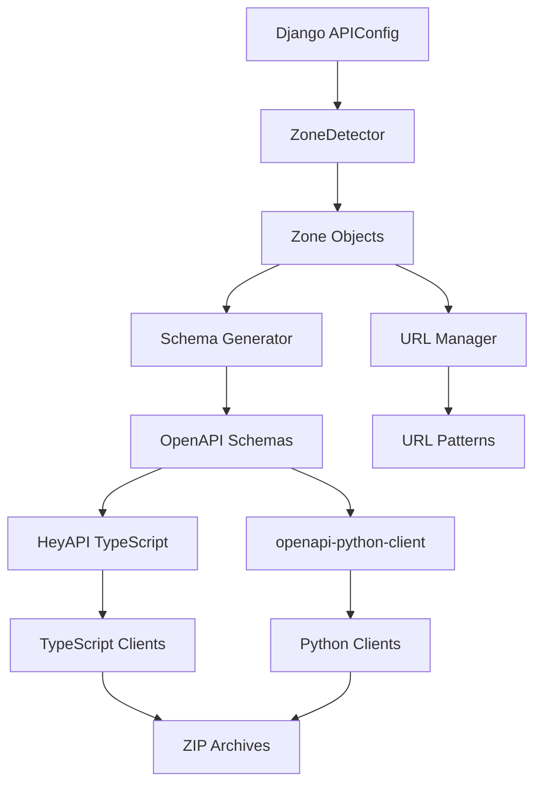

%%README.LLM id=django-revolution-architecture%%

# Architecture

**How Django Revolution works under the hood.**

## 🎯 Purpose

Understand Django Revolution's modular architecture. Clean components, clear separation of concerns.

## ✅ Rules

- Zone-based organization
- Auto-discovery from Django configuration
- Industry-standard tools (HeyAPI, openapi-python-client)
- KISS principle throughout

## 🏗️ Core Components

### Zone Management (`zones/`)

- **ZoneManager** - Manages API zones and URL pattern generation
- **ZoneDetector** - Auto-finds zones from Django `api.config.APIConfig`
- **Zone** - Pydantic model representing individual zone configuration
- **ZoneConfig** - Base configuration for defining zones

### URL Integration (`urls_integration.py`)

- **add_revolution_urls()** - Main entry point for URL generation
- **get_revolution_urlpatterns()** - Get URL patterns for integration
- **get_revolution_urls_info()** - Get URL information and metadata

### OpenAPI Generation (`openapi/`)

- **OpenAPIGenerator** - Orchestrates the entire generation process
- **HeyAPITypeScriptGenerator** - TypeScript client generation using HeyAPI
- **PythonClientGenerator** - Python client generation using openapi-python-client
- **ArchiveManager** - Manages client archiving and packaging
- **MonorepoSync** - Handles monorepo synchronization
- **Template System** - Jinja2 templates for custom client generation
- **Auto-installer** - Automatically installs npm dependencies

### Management Commands (`management/`)

- **revolution** - Django management command with rich CLI interface
- **Auto-dependency installation** - Installs HeyAPI and openapi-python-client
- **Status checking** - Validates system state and dependencies

## 📊 System Flow



## 🔧 How It Works

### Zone Detection Process

```python
# 1. ZoneDetector scans for api.config.APIConfig
detector = ZoneDetector(logger)
zones = detector.detect_zones()

# 2. Converts to Zone objects with validation
for zone_name, zone_data in zones.items():
    zone = Zone(
        name=zone_name,  # 'public' or 'private'
        apps=zone_data['apps'],  # ['public_api'] or ['private_api']
        title=zone_data.get('title', zone_name.title()),
        description=zone_data.get('description'),
        # ... other attributes
    )
```

### URL Generation

```python
# 1. Creates dynamic URL modules for each zone
def create_zone_urlconf_module(zone_name, zone_config):
    # Generates Python module with URL patterns

# 2. Creates schema endpoints
urlpatterns = [
    path('schema/', SpectacularAPIView.as_view(urlconf=zone_urlconf)),
    path('schema/swagger/', SpectacularSwaggerView.as_view()),
]
```

### Schema Generation

```python
# 1. Uses Django's spectacular to generate schemas
cmd = [
    "python", "manage.py", "spectacular",
    "--file", schema_file,
    "--urlconf", zone_urlconf_module
]

# 2. Creates isolated schemas per zone
schemas/
├── public.yaml
├── private.yaml
└── partner.yaml
```

### Client Generation Pipeline

```python
# 1. TypeScript generation (HeyAPI)
cmd = [
    'npx', '@hey-api/openapi-ts',
    '--input', schema_path,
    '--output', output_dir,
    '--client', 'legacy/fetch'
]

# 2. Python generation (openapi-python-client)
cmd = [
    'openapi-python-client',
    'generate',
    '--url', f'file://{schema_path}',
    '--output-path', output_dir
]

# 3. Template rendering (Jinja2)
template.render(zone_name=zone.name, apps=zone.apps)

# 4. Archiving to ZIP
zipfile.ZipFile(archive_path, 'w')
```

## 📁 Module Structure

```
django_revolution/
├── __init__.py                    # Main exports
├── apps.py                       # Django app configuration
├── config.py                     # Pydantic configuration models
├── utils.py                      # Utilities and helpers
├── cli.py                        # Standalone CLI interface
├── urls_integration.py           # URL integration helpers
├── drf_config.py                 # DRF configuration
├── zones/
│   ├── __init__.py               # ZoneManager, ZoneDetector
│   ├── public_urls.py            # Generated public zone URLs
│   ├── private_urls.py           # Generated private zone URLs
│   ├── admin_urls.py             # Generated admin zone URLs
│   └── ...                       # Other generated zone URLs
├── openapi/
│   ├── __init__.py               # OpenAPI exports
│   ├── generator.py              # Main OpenAPI orchestrator
│   ├── heyapi_ts.py             # TypeScript generator
│   ├── python_client.py         # Python generator
│   ├── archive_manager.py       # Archive management
│   ├── monorepo_sync.py         # Monorepo synchronization
│   ├── utils.py                 # OpenAPI utilities
│   └── templates/               # Jinja2 templates
│       ├── __init__.py.j2       # Python package template
│       ├── index.ts.j2          # TypeScript index template
│       ├── package.json.j2      # NPM package template
│       └── index_consolidated.ts.j2  # Consolidated exports
└── management/
    └── commands/
        └── revolution.py         # Django management command
```

## 🛠️ Configuration System

### Auto-Detection Configuration

```python
# Django Revolution auto-detects this pattern:
# api/config.py
from django_revolution import ZoneConfig

class APIConfig(ZoneConfig):
    zones = {
        'public': {
            'apps': ['public_api'],          # Required
            'title': 'Public API',           # Auto-generated if missing
            'description': 'Public API for users and posts', # Auto-generated if missing
            'public': True,                  # Default: True
            'auth_required': False,          # Default: False
            'version': 'v1',                 # Default: 'v1'
            'path_prefix': 'public'          # Default: zone_name
        },
        'private': {
            'apps': ['private_api'],         # Required
            'title': 'Private API',          # Auto-generated if missing
            'description': 'Private API for categories and products', # Auto-generated if missing
            'public': False,                 # Default: True
            'auth_required': True,           # Default: False
            'version': 'v1',                 # Default: 'v1'
            'path_prefix': 'private'         # Default: zone_name
        }
    }
```

### Generated Configuration

```python
# Automatic configuration from get_config():
{
    'output': {
        'base_directory': 'openapi',
        'schemas_directory': 'schemas',
        'clients_directory': 'clients',
        'archive_directory_ts': 'archive/typescript',
        'archive_directory_py': 'archive/python'
    },
    'generators': {
        'typescript': {
            'enabled': True,
            'output_directory': 'openapi/clients/typescript',
            'settings': {'output_format': 'prettier'}
        },
        'python': {
            'enabled': True,
            'output_directory': 'openapi/clients/python',
            'settings': {
                'project_name_template': 'django_revolution_{zone}',
                'overwrite': True
            }
        }
    }
}
```

## 🧩 Extension Points

### Custom Zone Types

```python
# Extend ZoneModel for custom functionality
class CustomZoneModel(ZoneModel):
    """Custom zone with additional features."""
    rate_limit: Optional[str] = None
    custom_middleware: List[str] = Field(default_factory=list)

    def get_rate_limit_config(self):
        # Custom rate limiting logic
        pass
```

### Custom Templates

```python
# Override default templates
class CustomHeyAPIGenerator(HeyAPITypeScriptGenerator):
    def _generate_template_files(self, zone, output_dir):
        # Use custom templates
        custom_templates_dir = Path('custom/templates')
        # ... custom template rendering
```

### Custom Generators

```python
# Add new client generators
class SwiftClientGenerator:
    def generate(self, zone: Zone, schema_path: str):
        # Generate Swift client
        pass

# Register in OpenAPIGenerator
generator.swift_generator = SwiftClientGenerator(config, logger)
```

## 🔍 Error Handling

### Graceful Degradation

```python
# ErrorHandler provides consistent error management
try:
    result = operation()
except Exception as e:
    return error_handler.handle_exception(e, "Operation context")
    # Logs error, continues with other operations
```

### Dependency Validation

```python
# Auto-installer checks and installs dependencies
dependencies = [
    {'name': '@hey-api/openapi-ts', 'check_cmd': ['npx', '@hey-api/openapi-ts', '--version']},
    {'name': 'openapi-python-client', 'check_cmd': ['openapi-python-client', '--version']}
]

# Automatically installs missing dependencies
auto_install_dependencies()
```

### Rich Logging

```python
# Logger provides beautiful console output
logger.info("🔍 Detecting zones...")
logger.success("✅ Generated TypeScript client for customer zone")
logger.error("❌ Failed to generate schema for admin zone")
logger.warning("⚠️ Node.js not found, skipping TypeScript generation")
```

%%END%%
