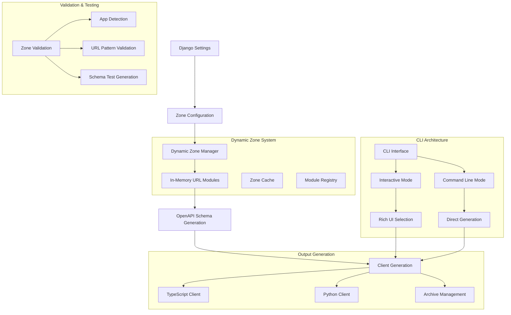

# Architecture - Django Revolution

## Overview

Django Revolution introduces a **dynamic zone-based architecture** that organizes your Django API into logical, isolated sections. Each zone represents a different context or access level for your API endpoints, with **in-memory generation** eliminating the need for static files.

## Key Innovations

- **Dynamic Zone Management** - No static zone files required
- **In-Memory Generation** - Everything generated dynamically
- **Zone-Based Organization** - Logical grouping of API endpoints
- **Performance Optimization** - Multithreaded processing and caching

## Architecture Modules

### django_revolution.zones.DynamicZoneManager
**Purpose**: Manages zone configuration and URL generation in-memory.
**Dependencies**: `django.urls`, `types.ModuleType`, `django_revolution.app_config`
**Exports**: `create_dynamic_urlconf_module`, `detect_apps_in_zone`, `validate_zone_configuration`
**Used in**: Zone URL pattern generation, app detection, dynamic module creation

### django_revolution.zones.DynamicZoneDetector
**Purpose**: Detects Django apps and their URL patterns.
**Dependencies**: `django.apps`, `django.urls`, `pathlib`
**Exports**: `detect_apps`, `get_app_url_patterns`, `app_exists`
**Used in**: App discovery, URL pattern analysis, zone validation

### django_revolution.openapi.generator.OpenAPIGenerator
**Purpose**: Generates OpenAPI schemas and client libraries.
**Dependencies**: `@hey-api/openapi-ts`, `datamodel-code-generator`, `drf-spectacular`
**Exports**: `generate_schemas`, `generate_typescript_client`, `generate_python_client`
**Used in**: Schema generation, TypeScript/Python clients, archive management

### django_revolution.cli
**Purpose**: Command-line interface with multiple modes.
**Dependencies**: `questionary`, `rich`, `click`
**Exports**: `main` (CLI entry point), interactive/command line modes
**Used in**: Django management commands, standalone CLI, development scripts

## Architecture Flows

### Dynamic URL Structure Flow
1. **Zone Configuration** - Pydantic models define zone structure
2. **App Detection** - `DynamicZoneDetector` finds apps in each zone
3. **URL Generation** - `DynamicZoneManager` creates URL modules in-memory
4. **Pattern Registration** - URL patterns registered with Django router
5. **Schema Generation** - OpenAPI schemas generated for each zone

**Modules**: `django_revolution.zones.DynamicZoneManager`, `django_revolution.zones.DynamicZoneDetector`, `django_revolution.openapi.generator`

### Zone-Based Organization Flow
1. **Zone Definition** - Define zones with apps, authentication, and metadata
2. **Access Level Assignment** - Public, private, admin, or internal zones
3. **Authentication Configuration** - JWT, session, or no authentication
4. **Rate Limiting Setup** - Different limits per zone
5. **Documentation Generation** - Separate OpenAPI schemas per zone

**Modules**: `django_revolution.app_config.ZoneConfig`, `django_revolution.zones`

### In-Memory Generation Flow
1. **Configuration Parsing** - Parse zone configuration from settings
2. **Module Creation** - Create URL modules dynamically in memory
3. **Pattern Detection** - Detect URL patterns from Django apps
4. **Schema Generation** - Generate OpenAPI schemas for each zone
5. **Client Generation** - Generate TypeScript and Python clients

**Modules**: `django_revolution.zones.DynamicZoneManager`, `django_revolution.openapi.generator.OpenAPIGenerator`

## Zone-Based Architecture

### What are Zones?

Zones are logical groupings of API endpoints that share common characteristics:

- **Access level** (public, private, internal, admin)
- **Authentication requirements** (none, JWT, session)
- **Rate limiting** (different limits per zone)
- **Documentation** (separate OpenAPI schemas)
- **Client generation** (zone-specific clients)

### Zone Types

#### Public Zone
- **Purpose**: External-facing API endpoints
- **Authentication**: Optional (JWT or none)
- **Rate Limiting**: Strict
- **Examples**: User registration, product catalog, public data

#### Private Zone
- **Purpose**: Authenticated user endpoints
- **Authentication**: Required (JWT)
- **Rate Limiting**: Moderate
- **Examples**: User profile, orders, personal data

#### Internal Zone
- **Purpose**: Internal service communication
- **Authentication**: Service-to-service
- **Rate Limiting**: High
- **Examples**: Microservice APIs, internal tools

#### Admin Zone
- **Purpose**: Administrative operations
- **Authentication**: Admin users only
- **Rate Limiting**: Low
- **Examples**: User management, analytics, system config

## Dynamic Architecture Components

### 1. Zone Configuration with Pydantic Models

```python
# settings.py
from django_revolution.app_config import ZoneConfig, get_revolution_config

zones = {
    'public': ZoneConfig(
        apps=['accounts', 'products'],
        title='Public API',
        description='Public endpoints',
        public=True,
        auth_required=False,
        version='v1'
    ),
    'private': ZoneConfig(
        apps=['orders', 'profile'],
        title='Private API',
        description='Authenticated endpoints',
        public=False,
        auth_required=True,
        version='v1'
    )
}

DJANGO_REVOLUTION = get_revolution_config(
    project_root=BASE_DIR,
    zones=zones,
    debug=DEBUG
)
```

### 2. Dynamic URL Structure

Django Revolution automatically creates a structured URL hierarchy **in-memory**:

```
/api/
├── public/
│   ├── schema/          # Swagger UI
│   ├── schema.yaml      # OpenAPI spec
│   └── v1/              # API endpoints
├── private/
│   ├── schema/
│   ├── schema.yaml
│   └── v1/
└── admin/
```

### 3. Dynamic Zone Management

**Key Innovation**: No static zone files required!

```python
# Old approach (static files)
# zones/
#   ├── public_urls.py
#   ├── private_urls.py
#   └── admin_urls.py

# New approach (dynamic generation)
from django_revolution.zones import DynamicZoneManager

zone_manager = DynamicZoneManager()
urlconf_module = zone_manager.create_dynamic_urlconf_module('public', zone_config)
```

## Data Flow Architecture



## Core Components

### 1. DynamicZoneManager

**Purpose**: Manages zone configuration and URL generation in-memory.

```python
class DynamicZoneManager:
    def create_dynamic_urlconf_module(self, zone_name: str, zone_config: ZoneConfig) -> ModuleType:
        """Create URL configuration module in-memory."""
        
    def detect_apps_in_zone(self, zone_config: ZoneConfig) -> List[str]:
        """Detect Django apps that belong to a zone."""
        
    def validate_zone_configuration(self, zone_name: str, zone_config: ZoneConfig) -> bool:
        """Validate zone configuration and dependencies."""
```

### 2. OpenAPIGenerator

**Purpose**: Generates OpenAPI schemas and client libraries.

```python
class OpenAPIGenerator:
    def generate_schemas(self) -> Dict[str, Path]:
        """Generate OpenAPI schemas for all zones."""
        
    def generate_typescript_client(self) -> Path:
        """Generate TypeScript client using @hey-api/openapi-ts."""
        
    def generate_python_client(self) -> Path:
        """Generate Python client using datamodel-code-generator."""
```

### 3. CLI Architecture

**Purpose**: Provides multiple interfaces for interaction.

```python
# Django Management Command
python manage.py revolution

# Standalone CLI
django-revolution

# Development Scripts
python scripts/dev_cli.py
```

## Key Innovations

### 1. Dynamic Zone Management

**Before**: Static zone files in `zones/` directory
```python
# zones/public_urls.py (static file)
from django.urls import path
from accounts.views import UserViewSet

urlpatterns = [
    path('users/', UserViewSet.as_view()),
]
```

**After**: In-memory generation from configuration
```python
# Dynamic generation based on zone config
zone_manager = DynamicZoneManager()
urlconf_module = zone_manager.create_dynamic_urlconf_module('public', zone_config)
```

### 2. Rich CLI Interface

**Interactive Mode**: Beautiful terminal interface with questionary
**Command Line Mode**: Direct command execution
**Development Tools**: Comprehensive development workflow

### 3. Validation & Testing

**Zone Validation**: Detailed validation of each zone
**Schema Testing**: Test OpenAPI schema generation
**URL Pattern Validation**: Verify URL patterns are valid

## Integration Points

### 1. Django Integration

```python
# urls.py
from django_revolution.urls_integration import add_revolution_urls

urlpatterns = [
    # Your existing URLs
]

# Add Django Revolution URLs dynamically
urlpatterns = add_revolution_urls(urlpatterns)
```

### 2. DRF + Spectacular Integration

```python
# settings.py
from django_revolution.drf_config import create_drf_config

drf_config = create_drf_config(
    title='My API',
    description='My awesome API',
    version='1.0.0'
)

REST_FRAMEWORK = drf_config.get_rest_framework_settings()
SPECTACULAR_SETTINGS = drf_config.get_spectacular_settings()
```

### 3. Monorepo Integration

```python
# Optional monorepo integration
monorepo = MonorepoConfig(
    enabled=True,
    path='/path/to/monorepo',
    api_package_path='packages/api/src'
)
```

## Performance Characteristics

### Memory Usage
- **Dynamic Zone Generation**: ~5-10MB per zone
- **Module Registry**: ~1-2MB total
- **Zone Cache**: ~2-5MB total

### Generation Speed
- **Zone Detection**: ~100-500ms per zone
- **Schema Generation**: ~1-3s per zone
- **Client Generation**: ~2-5s per client type

### Scalability
- **Zones**: Unlimited (limited by Django app count)
- **Apps per Zone**: 1-50 recommended
- **Endpoints per Zone**: 1-1000 recommended

## Monitoring & Debugging

### Debug Mode

```bash
export DJANGO_REVOLUTION_DEBUG=1
python manage.py revolution --debug
```

### Validation Commands

```bash
# Validate zones
python manage.py revolution --validate-zones

# Test schema generation
python manage.py revolution --test-schemas

# Show zone URLs
python manage.py revolution --show-urls
```

### Logging

```python
import logging
logging.getLogger('django_revolution').setLevel(logging.DEBUG)
```

## Best Practices

### 1. Zone Organization

- **Keep zones focused**: Each zone should have a clear purpose
- **Limit apps per zone**: 5-15 apps per zone is optimal
- **Use descriptive names**: `public`, `admin`, `internal`, `mobile`

### 2. Configuration Management

- **Use Pydantic models**: Type-safe configuration
- **Environment-specific configs**: Different zones for different environments
- **Version control**: Track zone configuration changes

### 3. Development Workflow

- **Use development CLI**: `python scripts/dev_cli.py`
- **Validate before generation**: Always validate zones first
- **Test schema generation**: Ensure schemas are valid

### 4. Performance Optimization

- **Cache zone detection**: Results are cached for performance
- **Lazy loading**: Modules are created only when needed
- **Memory management**: Old modules are cleaned up automatically

---

[Next: Troubleshooting](/docs/troubleshooting) · [Changelog](/docs/changelog) 